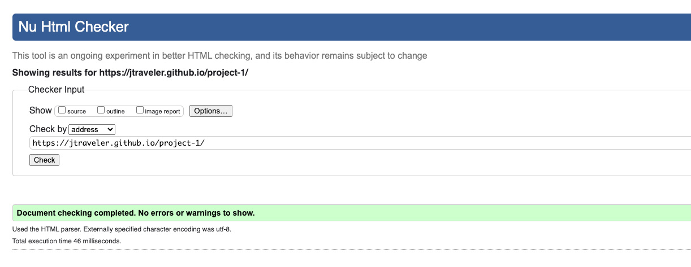
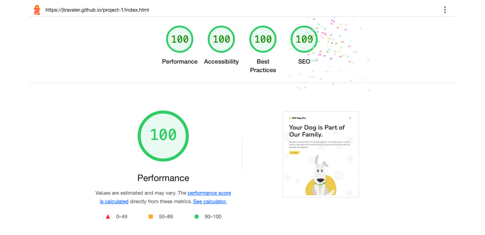

# project-1

# NYC Dog Pro

Project 1 - Matthew Johnson

[View live github project](https://jtraveler.github.io/project-1/)

# NYC Dog Pro

My 4 year old son inspired me for this project as he keeps asking if he can have a puppy. Therefore that cause me to often think of dogs and dog care. Also, I met my wife in New York city so I also got inspired to create a fictional dog care business in New York City, thus I create 'NYC Dog Pro', which is a fictional dog care business business based in Brooklyn, NY. I wanted to make the website clean, bright and interesting for dog lovers. The primary services that NYC Dog Pro offers is dog walking, doggie daycare, dog training and vet care. The website uses brand colors, attractive images and simple to read text.

## About 'NYC Dog Pro'

The fictional backstory of 'NYC Dog Pro', is that they are based in Brooklyn, New Yok, in very busy neighborhood that gets lots of clients. They are lead by world-renowned dog trainer Jaydon Rivera whi is the founder and CEO. 'NYC Dog Pro' team is he best in the city and have won various awards such as the prestigious 'Best Dog Walkers' award, awarded by Dog Lovers Magazine. Not only is the team extremely skilled but they are very diverse with people from all over the world. They are team of dog lovers and quality care for dogs is their passion.

Also, NYC Dog Pro just so happen runs a very popular podcast (or pawcast), which is a huge hit amongst the dog lover community. So nother goal is how to best present the podcast episodes and make them easily accessable.

## Table of Contents

1. [UX](#user-experience-ux)
   - [User Stories](#user-stories)
   - [New Clients and More Podcast Listeners](#new-clients-and-more-podcast-listeners)
2. [Design](#design)
   - [Wireframes](#wireframes)
3. [Deployment](#deployment)
4. [Features](#features)
5. [Testing](#testing)
    - [Browser Testing](#browser-testing)
    - [Code Validation](#code-validation)
    - [Lighthouse Test](#lighthouse-testing)
6. [Technologies Used](#technologies-used)
7. [Credits and Reference](#credits-and-reference)

## User Experience UX

### User Stories

Jaydon Rivera, the founder and CEO wanted to have his business rebranded and to have a new website redesign where clients can read all about the services and learn what makes NYC Dog Pro one of the best dog care business in New York. The problem with the old website that the style was too busy, not interesting, SEO was lacking and it had a hgih bounce rate. Also, the website lacked a personal touch with people not knowing much about the staff, the same people that would care for their pets. And finally, Juan Rivera, really wants have a the podcast episodes well preented on the website so people can easily listen to them.

### New Clients and More Podcast Listeners

The question is how to get new clients and make it so that users can easily play past podcasts. The website should display the following information in an easy to access format:

- Displaying the services offered
- Mentioning any awards
- Showing reviews
- Make it easy for people to book an appointment
- Descriptions of the services offered
- Provide some backgorund on the company

## Design

The website has 4 pages, which are all responsive. The look and feel should be fun and easy to navigate. And the user must be able to acess all of the pages regardless of which page they are currently on. Each page should follow the brand guidlines and styling.

### Brand Colours

## Wireframes

### Desktop Wireframes

### Sub Page Desktop Wireframe

### Mobile Wireframes

### Sub Page Mobile Wireframe

## Deployment

I used Github deploy my project.

### My Repository

1. I created a new local repository on on Github

2. I committed each major change to ensure I could always look back on it in case I needed to reference the history of my work. I added a detailed message for each commit.

For example:

- git add .
- git commit -m "I made this update and this is why this change is important"

3. I then used the 'git push' command to push to the live website.

## Features

I chose the features for this website to all users to easily navigate between sections. The look of the website was very important as I used some elements sich as lottie animations to enhance the user experience. I was able to customize each lottie to match the brand of NYC Dog Pro.

Lottie examples:

Credits:

Man walking created by Sofia Drankovich
(https://lottiefiles.com/free-animation/waling-men-listening-podcast-)

Idle Dog created by Zachary Christensen
(https://lottiefiles.com/free-animation/norm-the-dog-buvwpY646G)

Proud Dog created by Syed Asim Ali Shah
(https://lottiefiles.com/free-animation/dog-walking-7K4JCxjvHm)

Woman kissing dog creatd by Sabrina Picco
(https://lottiefiles.com/free-animation/happy-dog-day-AJlBp9pdM7)

Mailing Evelope creatd by GW
(https://lottiefiles.com/free-animation/mail-EjwVwj9a0h)

### Background Pattern

I used a playful paw shape for the background of the headers.

Image created by starline on Freepik
(https://tinyurl.com/mwxwjv6k)

### Navigation Menu

The navigation is very simplistic and and most importantly, responsive. It reflects the branding with displaying the logo and brand colors.

- The navigation on the mobile view is hidden but it's revealed once the user clicks on the hamburger menu icon on the right side.

- The hamburger menu icon is hidden on the tablet and desktop views allowing the user to see all of the menue items at once.

### Mobile Nav Bar

### Desktop Nav Bar

### Icons Used

I used icons from Font Awesome and Freepik

(https://fontawesome.com/)

Stars icons from Freepik

(https://tinyurl.com/jecd6jja)

### Images Used

I used Midjourney and ChatGPT for generatying all of the images on the website. For the staff photos, I wanted to go for classy studio style images that I could easily cutout the background. For the Pawcast photos, I wanted photos that capture humor and attention grabbing.

(https://www.midjourney.com/)
(https://www.chatgpt.com/)

### Pawcast Video Modal

#### Development Build
I used Lightbox for Boostrap 5 implementing the modal for when users click on one of the Pawcast episodes

[https://trvswgnr.github.io/bs5-lightbox/](https://trvswgnr.github.io/bs5-lightbox/) for Boostrap lightbox effect for the Pawcast episodes

#### Audio Generation

I used the power of Google's impressiive NotebookLM to create my Pawcast episodes that reference real artcles. NotebookLM genertes high quality conversational style dialog bwtween two people, which I thought would be perfect for what I need.

[https://notebooklm.google.com/](https://notebooklm.google.com/)

#### Creating the Video

I used the audio that was generated from NotbookLM to create a simplistic video with using Adobe Premiere. I used the same styling from the website for consistency. Within premiere I was able to transcribe the audio and generate captions. This is good as I wanted to add captions for hearing impaired folks since overall I'm aiming for accessability for this project.

[https://www.adobe.com/products/premiere.html](https://www.adobe.com/products/premiere.html)

#### Uploading and Customizing Video Player

Lastly, I uploaded each Pawcast video to Vimeo and customize the player's styling to match the website styling.

[https://www.vimeo.com](https://www.vimeo.com)

### Footer

The footer is simplistic and displays the navigation at all times. I used a footer template from MDG.

- I made sure that the logo is displayed
- A brief paragraph what the company is about
- Navigation link
- Contact information

Credit:

https://mdbootstrap.com/docs/standard/navigation/footer/

## Testing
## Browser Testing
I used ['Browser Stack'](https://live.browserstack.com/dashboard#os=Windows&os_version=11&browser=Chrome&browser_version=124.0&zoom_to_fit=true&full_screen=true&url=https%3A%2F%2Fbrogandaisy.github.io%2Fbrighton-beach-yoga%2Fabout.html&speed=1) to test a range of web browswers on desktop and mobile. See an example of tests below.
<table>
  <thead>
    <tr>
      <th>Browser</th>
      <th>Device</th>
      <th>Appearance</th>
      <th>Responsiveness</th>
    </tr>
  </thead>
  <tbody>
    <tr>
      <td>Chrome</td>
      <td>Google Pixel 8 and Desktop Surface 5</td>
      <td>All the pages format correctly. The links, nav and form all work well.</td>
      <td>Responsive design / Very good</td>
    </tr>
    <tr>
       <td>Edge</td>
       <td>iPad 7 and Desktop Macook Pro</td>
      <td>All the pages format correctly. The links, nav and form all work well.</td>
      <td>Responsive design / Very good</td>
    </tr>
    <tr>
      <td>Firefox</td>
      <td>iPhone 15 and Desktop Macbook Air</td>
      <td>All the pages format correctly. The links, nav and form all work well.</td>
      <td>Responsive design / Very good</td>
    </tr>
 
  </tbody>
</table>

## Responsive Testing

<table>
  <thead>
    <tr>
      <th>Device</th>
      <th>Max-Width 575px Result (Small Mobile)</th>
      <th>Min-Width 576px Result (Large Mobile)</th>
      <th>Min-Width 768px Result (Tablet)</th>
      <th>Min-Width 992px and Larger Result (Desktop)</th>
   </tr>
  </thead>
  <tbody>
    <tr>
      <td>Galaxy Fold</td>
      <td>Pass: All i displaying correctly.</td>
      <td>Pass: All i displaying correctly.</td>
      <td>N/A</td>
      <td>N/A</td>
    </tr>
    <tr>
       <td>iPhone 6/7/8 Plus</td>
       <td>Pass: All i displaying correctly.</td>
      <td>Pass: All i displaying correctly.</td>
      <td>N/A</td>
      <td>N/A</td>
    </tr>
    <tr>
      <td>iPad Air</td>
      <td>N/A</td>
      <td>N/A</td>
      <td>Pass: All i displaying correctly.</td>
      <td>Pass: All i displaying correctly.</td>
    </tr>
    <tr>
    <td>Macbook Air</td>
    <td>N/A</td>
    <td>N/A</td>
    <td>N/A</td>
    <td>Pass: All i displaying correctly.</td>
 
  </tbody>
</table>

## Device Formats

Mobile

Tablet

Desktop

## Code Validation
### HTML Validation
HTML validation for the homepage.

HTML validation for the About page.

HTML validation for the Pawcast page.

HTML validation for the Contact page.

HTML validation for the Success page.

## CSS Validation

## Lighthouse Testing
### Lighthouse Test Mobile - Homepage

### Lighthouse Test Desktop - Homepage

### Testing Errors and Improvements
When testing all the website pages using Lighthouse, I found the following areas that I can improve upon to increase the overall performance score:
- Format the HTML in a way that enables crawlers to better understand websit's content.
- Preload Largest Contentful Paint image
- Image elements do not have explicit width and height as setting an explicit width and height on image elements reduces layout shifts and improve CLS.
- Slow loading times. I converted images to webp format and resized my images to improve on page load times. This improved the score dramatically.
- Removing unused code elements in CSS. This improved the best practice score. Though some code related to Boostrap and Google fonts is out of my control.

## Manual testing of features

| Feature                                                                                              | Expected Result                                                                                                                      | Pass or Fail |
| :--------------------------------------------------------------------------------------------------- | :----------------------------------------------------------------------------------------------------------------------------------- | :----------: |
| Website logo in navigation menu links to homepage                                                    | User clicks on the logo to be taken to the homepage                                                                                  |     Pass     |
| Links in navigation menu                                                                             | Users click home, plants, or contact to be taken to the relevant page                                                                |     Pass     |
| Burger navigation in screens below 992px wide                                                        | Menu appears and dropdown navigation items appear                                                                                    |     Pass     |
| Hero section on all pages contains an explanatory title                                              | User understands what they can find on the page                                                                                        |     Pass     |
 | The images and text of the plants are linked to the correct information page                         | The user clicks and the relevant page is opened                                                                                      |     Pass     |
| Contact form allows messages to be submitted when correct information is entered      | The user understands what needs to be filled out                                                                                     |     Pass     |
| All fields of the contact form within the footer are a required field                                             | It's clear to the user that all fields are required as the message above the submit button is visible                                                 |     Pass     |
| Validation errors are in place for when the user doesn't fill in fields in the correct format | The user will know if they did not fill in the form correctly |     Pass     |
| The user is taken to the Success page see that it's obvious that the message was received and what the next steps are                                                                             | The user is taken the success page after submitting the form                                                |     Pass     |
| The modal for each Pawcast epsiode is displaying correctly on both mobile and desktop view | The user can preveiw the episode by clicking the play button                                                                                                |     Pass     |
| The video of each Pawcast episode does not play automatically and the user have full control of the video player along with closing the modal | The user won't be annoyed with the video experience has they have full control of the play/stop, timeline jumping, fullscreen, volume and close/exit features    |     Pass     |
| The video modal of each Pawcast works in both mobile and desktop views | The user can view the video play on both mobile and desktop views. |     Pass     |
| It's important to include the fullscreen feature for the Pawcast videos on mobile since the video appears small by default since the video is in horozontal format | The user can view the video in full screen mode and instructions are provided to exit fullscreen mode |     Pass     |
| The AI Hosts speaking in the video know what they are talking about based on the data that was fed to them and they are not talking about unrelated topics | The hosts on focused on the topics, references sources and are entertaining |     Pass     |
| The lotti animations are displaying properly on different devices | The lottie appears on all devices tested using Browserstack though it's important to note that the do not appear on mobile view due to cuasing the site to load slightly slower |    Pass     |
| The lotti animations are displaying properly on different devices | The lottie appears on all devices tested using Browserstack though it's important to note that the do not appear on mobile view due to cuasing the site to load slightly slower |    Pass     |
| All buttons and linkf function and perform the correct operation | All buttons and links appear to work well for thie intended use |    Pass     |

## Technologies Used

### Languages

HTML and CSS languages only.

### Technology

Github, Boostrap, AI for audio and images.

## Credits and Reference

- Mentor: Spencer Barriball
- Facilitator: Kay Welfare

Throughout the website build I used the following sources:

- I used example code from Code Institute projects
- [W3Schools.com](https://www.w3schools.com/)
- [Midjourney.com](https://midjourney.com/) for images
- [ChatGTP.com](https://chatgpt.com/) for images
- [Freepik](https://www.freepik.com/) for favicon design
- [https://trvswgnr.github.io/bs5-lightbox/](https://trvswgnr.github.io/bs5-lightbox/) for Boostrap lightbox effect for the Pawcast episodes
- [https://anywebp.com/convert-to-webp](https://anywebp.com/convert-to-webp) for converting my jpg image files into webp format
- [https://www.adobe.com/products/premiere.html](https://www.adobe.com/products/premiere.html) for video editing
- [https://www.adobe.com/products/photoshop.html](https://www.adobe.com/products/photoshop.html) for photo editing
- [https://www.vimeo.com](https://www.vimeo.com) for hosting my Pawcast videos
- [https://notebooklm.google.com/](https://notebooklm.google.com/) for generating the Pawcast audio for each episode

## Author

Matthew Johnson
