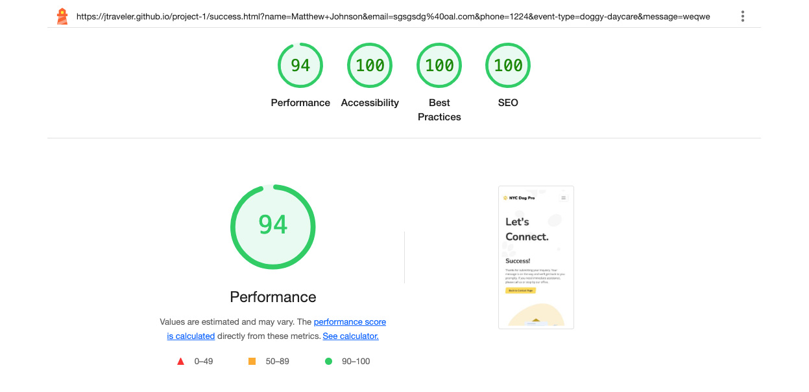

# project-1

# NYC Dog Pro

Project 1 - Matthew Johnson

[View live github project](https://jtraveler.github.io/project-1/)

# Inspiration for the Idea

My 4 year old son inspired me for this project as he keeps asking if he can have a puppy. Therefore that cause me to often think of dogs and dog care. Also, I met my wife in New York city so I also got inspired to create a fictional dog care business in New York City, thus I create 'NYC Dog Pro', which is a fictional dog care business business based in Brooklyn, NY. I wanted to make the website clean, bright and interesting for dog lovers. The primary services that NYC Dog Pro offers is dog walking, doggie daycare, dog training and vet care. The website uses brand colors, attractive images and simple to read text.

---

## About 'NYC Dog Pro'

The fictional backstory of 'NYC Dog Pro', is that they are based in Brooklyn, New Yok, in very busy neighborhood that gets lots of clients. They are lead by world-renowned dog trainer Jaydon Rivera whi is the founder and CEO. 'NYC Dog Pro' team is he best in the city and have won various awards such as the prestigious 'Best Dog Walkers' award, awarded by Dog Lovers Magazine. Not only is the team extremely skilled but they are very diverse with people from all over the world. They are team of dog lovers and quality care for dogs is their passion.

Also, NYC Dog Pro just so happen runs a very popular podcast (or pawcast), which is a huge hit amongst the dog lover community. One major goal was to present the podcast episodes and make them easily accessable.

---

## Table of Contents

1. [User Experience (UX)](#user-experience-ux)
   - [User Stories](#user-stories)
   - [New Clients and More Podcast Listeners](#new-clients-and-more-podcast-listeners)
2. [Design](#design)
   - [Wireframes](#wireframes)
3. [Deployment](#deployment)
4. [Features](#features)
5. [Testing](#testing)
   - [Browser Testing](#browser-testing)
   - [Lighthouse Testing](#lighthouse-testing)
6. [Technologies Used](#technologies-used)
7. [Credits and References](#credits-and-references)
8. [Author](#author)

---

## User Experience UX

### User Stories

Jaydon Rivera, the founder and CEO wanted to have his business rebranded and to have a new website redesign where clients can read all about the services and learn what makes NYC Dog Pro one of the best dog care business in New York. The problem with the old website that the style was too busy, not interesting, SEO was lacking and it had a hgih bounce rate. Also, the website lacked a personal touch with people not knowing much about the staff, the same people that would care for their pets. And finally, Juan Rivera, really wants have a the podcast episodes well preented on the website so people can easily listen to them.

### New Clients and More Podcast Listeners

The question is how to get new clients and make it so that users can easily play past podcasts. The website should display the following information in an easy to access format:

- Displaying the services offered
- Mentioning any awards
- Showing reviews
- Make it easy for people to book an appointment
- Descriptions of the services offered
- Provide some backgorund on the company

---

## Wireframes

These are the rough wireframes in which I had built to be the base skeleton of how I wante to layout the content. The actual layout changed over time but the wireframes was a great starting point as I was easily able to move things around if UX layout needed to be improved.

Screenshot Validations

### Desktop Wireframes

### Sub Page Desktop Wireframe

### Mobile Wireframes

### Sub Page Mobile Wireframe

---

## Design

The website has 5 pages (Homepage, About, Pawcast, Contact, Success), which are all responsive. The look and feel should be fun and easy to navigate. It's essential that the user is able to acess all of the pages (except the Success page, which can only accessed after the user submits the form)regardless of which page they are currently on. Each page should follow the brand guidlines and styling.

### Brand Colours

---

## Deployment

I used Github deploy my project.

### My Repository

1. I created a new local repository on on Github

2. I committed each major change to ensure I could always look back on it in case I needed to reference the history of my work. I added a detailed message for each commit.

For example:

- git add .
- git commit -m "I made this update and this is why this change is important"

3. I then used the 'git push' command to push to the live website.

---

## Features

I chose the particular features mentioned below to enhance the overall look, provide visual aids to the users and doen't weigh the site down with regards to page load time. The look of the website was very important as I have a background in UX/UI design. I used some elements such as lottie animations and videos for the Pawcast sections to enhance the user experience.

### Lottie Animations

I always wanted to use lottie animations on a web design project and this was the perfect opportunity to play around with lotties for the first time in a practicak setting. The great thing about lotties is that they not only animate bt they are light weight and can be customized. I was able to customize each lottie to match the brand colors of this NYC Dog Pro project. Though they are light weight regarding load time, they can cause the Lighthouse loading score to drop slightly so I hid the lottie animations on mobile to get a higher Lighthouse score.

Lottie examples:

Credits:

Man walking created by Sofia Drankovich
(https://lottiefiles.com/free-animation/waling-men-listening-podcast-)

Idle Dog created by Zachary Christensen
(https://lottiefiles.com/free-animation/norm-the-dog-buvwpY646G)

Proud Dog created by Syed Asim Ali Shah
(https://lottiefiles.com/free-animation/dog-walking-7K4JCxjvHm)

Woman kissing dog creatd by Sabrina Picco
(https://lottiefiles.com/free-animation/happy-dog-day-AJlBp9pdM7)

Mailing Evelope creatd by GW
(https://lottiefiles.com/free-animation/mail-EjwVwj9a0h)

---

### Background Pattern

I used a playful paw shape for the background of the headers.

Image created by starline on Freepik
(https://tinyurl.com/mwxwjv6k)

---

### Navigation Menu

The navigation is very simplistic and and most importantly, responsive. It reflects the branding with displaying the logo and brand colors.

- The navigation on the mobile view is hidden but it's revealed once the user clicks on the hamburger menu icon on the right side.

- The hamburger menu icon is hidden on the tablet and desktop views allowing the user to see all of the menue items at once.

---

### Mobile Nav Bar

---

### Desktop Nav Bar

---

### Icons Used

I used icons from Font Awesome and Freepik

(https://fontawesome.com/)

Stars icons from Freepik

(https://tinyurl.com/jecd6jja)

---

### Images Used

I used Midjourney and ChatGPT for generatying all of the images on the website. For the staff photos, I wanted to go for classy studio style images that I could easily cutout the background. For the Pawcast photos, I wanted photos that capture humor and attention grabbing.

(https://www.midjourney.com/)
(https://www.chatgpt.com/)

---

### Pawcast Video Modal

#### Development Build
I used Lightbox for Boostrap 5 implementing the modal for when users click on one of the Pawcast episodes

[https://trvswgnr.github.io/bs5-lightbox/](https://trvswgnr.github.io/bs5-lightbox/) for Boostrap lightbox effect for the Pawcast episodes

#### Audio Generation

I used the power of Google's impressiive NotebookLM to create my Pawcast episodes that reference real artcles that I fed it. NotebookLM genertes high quality conversational style dialog bwtween two people, which I thought would be perfect for what I need.

[https://notebooklm.google.com/](https://notebooklm.google.com/)

#### Research For Topics

I used Perplexity to find great sources for my Pawcast topics so that I could feed them to NotebookLM. The sources

[https://www.perplexity.ai/](https://www.perplexity.ai/) Perplexity for research

**Topic: City Runs with Your Pup: Best Routes Unleashed**

1. [20 Best Dog-Friendly Places in NYC](https://www.runstreet.com/blog/dog-friendly-places-in-nyc) 

2. [Exploring NYC’s Top Dog Walking Routes](https://lovepetcare.com/exploring-nycs-top-dog-walking-routes/) 

3. [Running in NYC with Your Dog: Tips & Best Routes](https://dogcitynyc.com/running-in-nyc-with-your-dog-tips-best-routes/) 

**Topic: Throwing the Ultimate Dog Birthday Bash**

1. [How to Throw the Best Birthday Party Ever for Your Dog](https://www.rover.com/blog/how-to-throw-dog-birthday-party/) 

2. [How to Celebrate Your Dog’s Birthday](https://www.akc.org/expert-advice/lifestyle/dog-birthday/) 

3. [It’s Pawty Time! Bone & Biscuit’s Ultimate Guide To Throwing An Epic Dog Birthday Party](https://boneandbiscuit.ca/its-pawty-time-bone-biscuits-ultimate-guide-to-throwing-an-epic-dog-birthday-party/) 

**Topic: Easy recipes your pup will love**

1. [Balanced Homemade Dog Food](https://stellanspice.com/balanced-dog-food/) 

2. [DIY Homemade Dog Food](https://damndelicious.net/2015/04/27/diy-homemade-dog-food/) 

3. [Easy Homemade Dog Food Recipe](https://thismessisours.com/easy-homemade-dog-food-recipe/) 

4. [Homemade Dog Food](https://www.allrecipes.com/recipe/140286/homemade-dog-food/) 

**Topic: Designing the Perfect Dog-Friendly Home**

1. [Everything You Need to Know About Designing A Dog-Friendly Home](https://stylebyemilyhenderson.com/blog/dog-friendly-design) 

2. [Your Happy Guide To Pet-Friendly Interior Design For Indian Homes](https://www.designcafe.com/blog/home-interiors/pet-friendly-interior-design-ideas/) 

3. [The Ultimate Guide to Pet-friendly Home Decor](https://everydaydogmagazine.com/pet-friendly-decor-guide/) 

4. [Ultimate Interior Design Guide for Pet Lovers](https://illustrarch.com/interior-design/36826-interior-design-guide-for-pet-lovers.html) 

**Topic: Best Dog Breeds for Children and Families.**

1. [Best Dog Breeds for Kids](https://www.akc.org/dog-breeds/best-dogs-for-kids/) 

2. [Best Family Dogs: Which Breed Is Right for You?](https://www.akc.org/expert-advice/dog-breeds/best-family-dogs/) 

3. [The best dog breeds for families with children](https://www.williamwalker.de/en/blogs/ww/die-besten-hunderassen-fur-familien-mit-kindern-kindgerechte-begleiter) 

4. [Ultimate Interior Design Guide for Pet Lovers](https://illustrarch.com/interior-design/36826-interior-design-guide-for-pet-lovers.html)

**Topic: Tips and Tricks for Traveling with Your Furry Friend.**

1. [Pet Travel Tips](https://www.centerforpetsafety.org/faqs/pet-travel-tips/) 

2. [Travel Safety Tips](https://www.aspca.org/pet-care/general-pet-care/travel-safety-tips) 

3. [Travel safely with your pet](https://www.humaneworld.org/en/resources/travel-safely-your-pet-car-airplane-ship-or-train) 

**Topic: Picking a Dog That Fits to Your Personality.**

1. [Choosing a Dog Breed That Matches Your Energy Level](https://www.ovrs.com/blog/dog-breed-that-matches-your-energy-level/) 

2. [Does Your Dog’s Personality Match Yours?](https://www.eastvalleyanimal.com/does-your-dogs-personality-match-yours/) 

3. [Does Your Personality Match Your Dogs? Signs to Look For!](https://www.adaptil.co.uk/blogs/news/does-your-personality-match-your-dogs-signs-to-look-for) 

4. [People choose their dogs according to their own personality, say Kennel Club](https://www.bbc.co.uk/newsround/63201640)

#### Creating the Video

I used the audio that was generated from NotbookLM to create a simplistic video with using Adobe Premiere. I used the same styling from the website for consistency. Within premiere I was able to transcribe the audio and generate captions. This is good as I wanted to add captions for hearing impaired folks since overall I'm aiming for accessability for this project.

[https://www.adobe.com/products/premiere.html](https://www.adobe.com/products/premiere.html)

#### Uploading and Customizing Video Player

Lastly, I uploaded each Pawcast video to Vimeo and customize the player's styling to match the website styling.

[https://www.vimeo.com](https://www.vimeo.com)

---

### Footer

The footer is simplistic and displays the navigation at all times. I used a footer template from MDG.

- I made sure that the logo is displayed
- A brief paragraph what the company is about
- Navigation link
- Contact information

Credit:

https://mdbootstrap.com/docs/standard/navigation/footer/

---
## Testing

### Browser Testing
I used ['Browser Stack'](https://live.browserstack.com/dashboard#os=Windows&os_version=11&browser=Chrome&browser_version=124.0&zoom_to_fit=true&full_screen=true&url=https%3A%2F%2Fbrogandaisy.github.io%2Fbrighton-beach-yoga%2Fabout.html&speed=1) to test a range of web browswers on desktop and mobile. See an example of tests below.
<table>
  <thead>
    <tr>
      <th>Browser</th>
      <th>Device</th>
      <th>Appearance</th>
      <th>Responsiveness</th>
    </tr>
  </thead>
  <tbody>
    <tr>
      <td>Chrome</td>
      <td>Google Pixel 8 and Desktop Surface 5</td>
      <td>All the pages format correctly. The links, nav and form all work well.</td>
      <td>Responsive design / Very good</td>
    </tr>
    <tr>
       <td>Edge</td>
       <td>iPad 7 and Desktop Macook Pro</td>
      <td>All the pages format correctly. The links, nav and form all work well.</td>
      <td>Responsive design / Very good</td>
    </tr>
    <tr>
      <td>Firefox</td>
      <td>iPhone 15 and Desktop Macbook Air</td>
      <td>All the pages format correctly. The links, nav and form all work well.</td>
      <td>Responsive design / Very good</td>
    </tr>
 
  </tbody>
</table>

### Responsive Testing

<table>
  <thead>
    <tr>
      <th>Device</th>
      <th>Max-Width 575px Result (Small Mobile)</th>
      <th>Min-Width 576px Result (Large Mobile)</th>
      <th>Min-Width 768px Result (Tablet)</th>
      <th>Min-Width 992px and Larger Result (Desktop)</th>
   </tr>
  </thead>
  <tbody>
    <tr>
      <td>Galaxy Fold</td>
      <td>Pass: All i displaying correctly.</td>
      <td>Pass: All i displaying correctly.</td>
      <td>N/A</td>
      <td>N/A</td>
    </tr>
    <tr>
       <td>iPhone 6/7/8 Plus</td>
       <td>Pass: All i displaying correctly.</td>
      <td>Pass: All i displaying correctly.</td>
      <td>N/A</td>
      <td>N/A</td>
    </tr>
    <tr>
      <td>iPad Air</td>
      <td>N/A</td>
      <td>N/A</td>
      <td>Pass: All i displaying correctly.</td>
      <td>Pass: All i displaying correctly.</td>
    </tr>
    <tr>
    <td>Macbook Air</td>
    <td>N/A</td>
    <td>N/A</td>
    <td>N/A</td>
    <td>Pass: All i displaying correctly.</td>
 
  </tbody>
</table>

### Device Formats

Mobile

Tablet

Desktop

---

### Testing for the Homepage

#### Lighthouse Report Summary

The Lighthouse audit for the Homepage shows excellent results, with top marks in Accessibility, Best Practices, and SEO. The **Performance score of 89** suggests the page is well-optimised overall, though improvements could be made by reducing render-blocking resources and shortening the time it takes for the Largest Contentful Paint (LCP) to appear. By the way, these are the results for mobile since I'm evaluating based on a mobile-first approach but the visuals for the desktop results are below.

Overall scores:

| Category       | Score |
|----------------|-------|
| **Performance**    | 89    |
| **Accessibility**  | 100   |
| **Best Practices** | 100   |
| **SEO**            | 100   |

#### A Few Areas for Improvement

1. **Eliminate Render-Blocking Resources**  
   – This is a significant opportunity with potential savings of **1,930 ms**. Consider deferring non-critical CSS and loading JavaScript asynchronously.

2. **Optimize Largest Contentful Paint (LCP) Element**  
   – Current LCP time is **2,960 ms**. Optimizing and preloading hero images or reducing layout complexity could bring this down.

3. **Preload the Largest Contentful Paint Image**  
   – Maybe explor adding a `<link rel="preload">` for the hero or main image can speed up visual load times.

4. **Add Explicit Width & Height to Images**  
   – Helps avoid layout shifts and improves cumulative layout shift (CLS) score.

5. **Minify CSS**  
   – Potential savings of **2 KiB** can be achieved by cleaning and compressing existing CSS files.

6. **Serve Static Assets with Better Caching**  
   – **17 resources** were flagged with short or inefficient cache policies. Increasing max-age headers could improve repeat visits.

7. **Avoid Serving Legacy JavaScript to Modern Browsers**  
   – Sending modern JavaScript bundles to modern browsers can reduce payload size and parsing time.

8. **Reduce Unused CSS & JavaScript**  
   – Unused CSS: **26 KiB**  
   – Unused JS: **71 KiB**  
   – Tree-shaking, code splitting, or auditing components could help.

#### What's Working Well

- **Flawless Accessibility, SEO, and Best Practices scores**
- **Critical request chains are minimal** – Only 5 chains found
- **Third-party code has zero blocking impact**
- **No severe long-task delays or layout instability**

Screenshot Validations

#### HTML Validator Testing

#### Lighthouse Test - Mobile

#### Lighthouse Testing - Desktop

---

### Testing for the About Page

#### Lighthouse Report Summary

The About page scored very well in the Lighthouse audit, achieving perfect ratings for both Best Practices and SEO. Accessibility also performed strongly at 96. **The Performance score sits at 95**, indicating a high level of optimisation, though there are still a few minor tweaks that could make the page even more efficient. By the way, these are the results for mobile since I'm evaluating based on a mobile-first approach but the visuals for the desktop results are below.

Overall scores:

| Category       | Score |
|----------------|-------|
| **Performance**    | 95    |
| **Accessibility**  | 96    |
| **Best Practices** | 100   |
| **SEO**            | 100   |

#### A Few Areas for Improvement

1. **Minimize Main-Thread Work**  
   – Current processing time is **2.5 seconds**, likely due to JavaScript and style recalculations. Optimizing heavy scripts and reducing DOM complexity may help.

2. **Eliminate Render-Blocking Resources**  
   – Around **220 ms** of blocking could be avoided by deferring non-critical CSS/JS or loading scripts asynchronously.

3. **Reduce Unused CSS**  
   – Potential savings of **26 KiB**. Auditing and trimming unused styles will reduce total CSS payload.

4. **Preload the Largest Contentful Paint (LCP) Image**  
   – Preloading can speed up the appearance of the most important visual content.

5. **Add Explicit Width & Height to Images**  
   – This helps reduce layout shifts and improves CLS (Cumulative Layout Shift).

6. **Minify CSS**  
   – A small optimization with potential savings of **2 KiB**.

7. **Serve Static Assets with an Efficient Cache Policy**  
   – **12 resources** would benefit from more aggressive caching for faster repeat visits.

8. **Avoid Serving Legacy JavaScript to Modern Browsers**  
   – Serve modern bundles to modern browsers to streamline JS delivery.

9. **Reduce Unused JavaScript**  
   – Roughly **107 KiB** of JavaScript is unused. Tree-shaking and dynamic imports could help.

#### What's Working Well

- **Excellent SEO and Best Practices scores**
- **No major layout shifts or critical rendering delays**
- **Third-party scripts are light** – only 160 ms of thread blocking
- **Minimal long tasks** – 4 long tasks and manageable request chains
- **Accessibility is near-perfect with room for tiny refinements**

Screenshot Validations

#### HTML Validator Testing

#### Lighthouse Test - Mobile

#### Lighthouse Testing - Desktop

---

### Testing for the Pawcast Page

#### Lighthouse Report Summary

According to the Lighthouse audit, the Pawcast page is in great condition. It received flawless results in accessibility, best practices, and SEO. With a **Performance score of 98**, it’s very close to full optimisation. Just a handful of front-end refinements could be enough to push it up to a perfect score. By the way, these are the results for mobile since I'm evaluating based on a mobile-first approach but the visuals for the desktop results are below.

Overall scores:

| Category       | Score |
|----------------|-------|
| **Performance**    | 97    |
| **Accessibility**  | 96    |
| **Best Practices** | 100   |
| **SEO**            | 100   |

#### A Few Areas for Improvement

1. **Reduce Unused CSS**  
   – Potential savings of **26 KiB**. Consider purging unused styles, especially from frameworks or unused utility classes.

2. **Eliminate Render-Blocking Resources**  
   – Minor improvement here, with **80 ms** of potential savings. Can be addressed by deferring non-critical CSS or JS.

3. **Minimize Main-Thread Work**  
   – JavaScript and layout processing are taking up **3.4 seconds**, which can delay interactivity.

4. **Preload the Largest Contentful Paint (LCP) Image**  
   – Preloading this image could help improve perceived load speed and performance.

5. **Add Explicit Width & Height to Images**  
   – This helps prevent layout shifts and improves CLS (Cumulative Layout Shift) score.

6. **Minify & Clean Up Unused CSS/JS**  
   – Small savings possible:
   - Minify CSS: **2 KiB**
   - Unused JavaScript: **101 KiB**

7. **Improve Cache Policy on Static Assets**  
   – **13 resources** could benefit from longer cache expiration headers.

8. **Avoid Serving Legacy JavaScript to Modern Browsers**  
   – Splitting legacy and modern bundles could improve performance for modern users.

#### What's Working

Screenshot Validations

#### HTML Validator Testing

#### Lighthouse Test - Mobile

#### Lighthouse Testing - Desktop

---

### Testing for the Contact Page

#### Lighthouse Report Summary

The Contact page performed strongly across the board in the Lighthouse audit. Accessibility and SEO both received full marks, and Best Practices scored just as high. The **Performance score landed at 87**, largely affected by render-blocking scripts, image loading strategy, and the LCP metric. Resolving these will move the page closer to peak performance. By the way, these are the results for mobile since I'm evaluating based on a mobile-first approach but the visuals for the desktop results are below.

Overall scores:

| Category       | Score |
|----------------|-------|
| **Performance**    | 97    |
| **Accessibility**  | 100   |
| **Best Practices** | 96    |
| **SEO**            | 100   |

#### A Few Areas for Improvement

1. **Eliminate Render-Blocking Resources**  
   – Major opportunity here, with potential savings of **2,030 ms**. Deferring or inlining critical CSS/JS could help.

2. **Preconnect to Required Origins**  
   – Preconnecting to external domains could save around **300 ms** in connection time.

3. **Serve Images in Next-Gen Formats**  
   – Potential savings of **138 KiB** by using formats like WebP or AVIF instead of JPEG/PNG.

4. **Optimize Largest Contentful Paint (LCP) Element**  
   – Current LCP time is **3,360 ms**. Consider compressing assets, deferring offscreen content, and improving load order.

5. **Preload the Largest Contentful Paint Image**  
   – Preloading this image will help improve time to first paint.

6. **Add Explicit Width & Height to Images**  
   – This helps reduce layout shifts and improves CLS (Cumulative Layout Shift).

7. **Minify & Clean Up Unused CSS/JS**  
   – Small cleanup opportunity:
   - Unused CSS: **26 KiB**
   - Unused JS: **71 Ki**

Screenshot Validations

### HTML Validator Testing

#### Lighthouse Test - Mobile

#### Lighthouse Testing - Desktop

---

### Testing for the Success Page

#### Lighthouse Report Summary

The  Success page scored nearly perfect in Accessibility, Best Practices, and SEO. However, the **Performance score came in at 85**, mostly due to delays caused by render-blocking content and a lengthy LCP. Streamlining JavaScript, adjusting image handling, and reducing main-thread activity would make a noticeable difference here. By the way, these are the results for mobile since I'm evaluating based on a mobile-first approach but the visuals for the desktop results are below.

Overall scores:

| Category       | Score |
|----------------|-------|
| **Performance**    | 94    |
| **Accessibility**  | 100   |
| **Best Practices** | 100   |
| **SEO**            | 100   |

#### A Few Areas for Improvement

1. **Eliminate Render-Blocking Resources**  
   – Potential savings of **960 ms**. Prioritize critical CSS and defer JS where possible.

2. **Optimize Largest Contentful Paint (LCP) Element**  
   – Current LCP time is **3,340 ms**. Consider reducing image size, using preload hints, and improving load order.

3. **Reduce Unused JavaScript**  
   – Roughly **103 KiB** of JS is unused. Clean up or split out code not needed on initial load.

4. **Minimize Main Thread Work**  
   – JavaScript and layout-related tasks are consuming **2.4 s**. This delays interactivity.

5. **Reduce Unused CSS**  
   – Around **26 KiB** of unused CSS was found. Purge unused styles, especially from frameworks.

6. **Preload the Largest Contentful Paint (LCP) Image**  
   – Preloading hero image will help speed up perceived performance.

7. **Add Explicit Width & Height to Images**  
   – Helps avoid layout shifts and improves cumulative layout shift (CLS) score.

8. **Minify & Clean Up CSS**  
   – Around **2 KiB** of minification opportunity is available.

9. **Improve Cache Policy on Static Assets**  
   – **7 static resources** would benefit from longer cache lifetimes.

10. **Avoid Serving Legacy JavaScript to Modern Browsers**  
   – Use modern JS bundles for users with up-to-date browsers to improve speed.

#### What's Working Well

- **Excellent accessibility and SEO** – Fully optimized
- **No major layout shifts** – Strong visual stability
- **Efficient critical request paths** – 8 chains found but not excessive
- **Third-party scripts are lightweight** – No heavy external dependencies

Screenshot Validations

#### HTML Validator Testing

#### Lighthouse Test - Mobile

#### Lighthouse Testing - Desktop

---

## CSS Validation

### Testing Errors and Improvements
When testing all the website pages using Lighthouse, I found the following areas that I can improve upon to increase the overall performance score:
- Format the HTML in a way that enables crawlers to better understand websit's content.
- Preload Largest Contentful Paint image
- Image elements do not have explicit width and height as setting an explicit width and height on image elements reduces layout shifts and improve CLS.
- Slow loading times. I converted images to webp format and resized my images to improve on page load times. This improved the score dramatically.
- Removing unused code elements in CSS. This improved the best practice score. Though some code related to Boostrap and Google fonts is out of my control.

---

## Manual testing of features

| Feature                                                                                              | Expected Result                                                                                                                      | Pass or Fail |
| :--------------------------------------------------------------------------------------------------- | :----------------------------------------------------------------------------------------------------------------------------------- | :----------: |
| Website logo in navigation menu links to homepage                                                    | User clicks on the logo to be taken to the homepage                                                                                  |     Pass     |
| Links in navigation menu                                                                             | Users click home, plants, or contact to be taken to the relevant page                                                                |     Pass     |
| Burger navigation in screens below 992px wide                                                        | Menu appears and dropdown navigation items appear                                                                                    |     Pass     |
| Hero section on all pages contains an explanatory title                                              | User understands what they can find on the page                                                                                        |     Pass     |
 | The images and text of the plants are linked to the correct information page                         | The user clicks and the relevant page is opened                                                                                      |     Pass     |
| Contact form allows messages to be submitted when correct information is entered      | The user understands what needs to be filled out                                                                                     |     Pass     |
| All fields of the contact form within the footer are a required field                                             | It's clear to the user that all fields are required as the message above the submit button is visible                                                 |     Pass     |
| Validation errors are in place for when the user doesn't fill in fields in the correct format | The user will know if they did not fill in the form correctly |     Pass     |
| The user is taken to the Success page see that it's obvious that the message was received and what the next steps are                                                                             | The user is taken the success page after submitting the form                                                |     Pass     |
| The modal for each Pawcast epsiode is displaying correctly on both mobile and desktop view | The user can preveiw the episode by clicking the play button                                                                                                |     Pass     |
| The video of each Pawcast episode does not play automatically and the user have full control of the video player along with closing the modal | The user won't be annoyed with the video experience has they have full control of the play/stop, timeline jumping, fullscreen, volume and close/exit features    |     Pass     |
| The video modal of each Pawcast works in both mobile and desktop views | The user can view the video play on both mobile and desktop views. |     Pass     |
| It's important to include the fullscreen feature for the Pawcast videos on mobile since the video appears small by default since the video is in horozontal format | The user can view the video in full screen mode and instructions are provided to exit fullscreen mode |     Pass     |
| The AI Hosts speaking in the video know what they are talking about based on the data that was fed to them and they are not talking about unrelated topics | The hosts on focused on the topics, references sources and are entertaining |     Pass     |
| The lotti animations are displaying properly on different devices | The lottie appears on all devices tested using Browserstack though it's important to note that the do not appear on mobile view due to cuasing the site to load slightly slower |    Pass     |
| The lotti animations are displaying properly on different devices | The lottie appears on all devices tested using Browserstack though it's important to note that the do not appear on mobile view due to cuasing the site to load slightly slower |    Pass     |
| All buttons and linkf function and perform the correct operation | All buttons and links appear to work well for thie intended use |    Pass     |

---

## Technologies Used

### Languages

HTML and CSS languages only.

### Technology

Github, Boostrap, AI for audio and images.

---

## Credits and Reference

- Mentor: Spencer Barriball
- Facilitator: Kay Welfare

Throughout the website build I used the following sources:

- I used example code from Code Institute projects
- [W3Schools](https://www.w3schools.com/)
- [Midjourney](https://midjourney.com/) for images
- [ChatGTP](https://chatgpt.com/) for images
- [Freepik](https://www.freepik.com/) for favicon design
- [Lightbox for Bootstrap 5](https://trvswgnr.github.io/bs5-lightbox/) for Boostrap lightbox effect for the Pawcast episodes
- [Anywebp.com](https://anywebp.com/convert-to-webp) for converting my jpg image files into webp format
- [Adobe Premiere](https://www.adobe.com/products/premiere.html) for video editing
- [Perplexity](https://www.perplexity.ai/) Perplexity for research
- [Adobe Photoshop](https://www.adobe.com/products/photoshop.html) for photo editing
- [Vimeo](https://www.vimeo.com) for hosting my Pawcast videos
- [Google's Notebook LM](https://notebooklm.google.com/) for generating the Pawcast audio for each episode

---

## Author

Matthew Johnson
