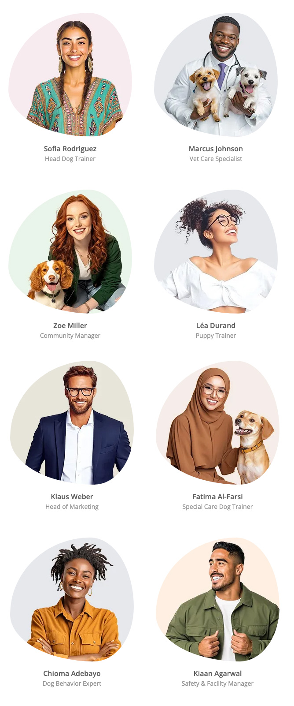

# project-1

# NYC Dog Pro

Project 1 - Matthew Johnson

[View live github project](https://jtraveler.github.io/project-1/)

# NYC Dog Pro

My 4 year old son inspired me for this project as he keeps asking if he can have a puppy. Therefore that cause me to often think of dogs and dog care. Also, I met my wife in New York city so I also got inspired to create a fictional dog care business in New York City, thus I create 'NYC Dog Pro', which is a fictional dog care business business based in Brooklyn, NY. I wanted to make the website clean, bright and interesting for dog lovers. The primary services that NYC Dog Pro offers is dog walking, doggie daycare, dog training and vet care. The website uses brand colors, attractive images and simple to read text.

## About 'NYC Dog Pro'

The fictional backstory of 'NYC Dog Pro', is that they are based in Brooklyn, New Yok, in very busy neighborhood that gets lots of clients. They are lead by world-renowned dog trainer Jaydon Rivera whi is the founder and CEO. 'NYC Dog Pro' team is he best in the city and have won various awards such as the prestigious 'Best Dog Walkers' award, awarded by Dog Lovers Magazine. Not only is the team extremely skilled but they are very diverse with people from all over the world. They are team of dog lovers and quality care for dogs is their passion.

Also, NYC Dog Pro just so happen runs a very popular podcast (or pawcast), which is a huge hit amongst the dog lover community. So nother goal is how to best present the podcast episodes and make them easily accessable.

## Table of Contents

1. [UX](#user-experience-ux)
   - [User Stories](#user-stories)
   - [New Clients and More Podcast Listeners](#new-clients-and-more-podcast-listeners)
2. [Design](#design)
   - [Wireframes](#wireframes)
3. [Deployment](#deployment)
4. [Features](#features)
5. [Technologies Used](#technologies-used)
6. [Credits and Reference](#credits-and-reference)

## User Experience UX

### User Stories

Jaydon Rivera, the founder and CEO wanted to have his business rebranded and to have a new website redesign where clients can read all about the services and learn what makes NYC Dog Pro one of the best dog care business in New York. The problem with the old website that the style was too busy, not interesting, SEO was lacking and it had a hgih bounce rate. Also, the website lacked a personal touch with people not knowing much about the staff, the same people that would care for their pets. And finally, Juan Rivera, really wants have a the podcast episodes well preented on the website so people can easily listen to them.

### New Clients and More Podcast Listeners

The question is how to get new clients and make it so that users can easily play past podcasts. The website should display the following information in an easy to access format:

- Displaying the services offered
- Mentioning any awards
- Showing reviews
- Make it easy for people to book an appointment
- Descriptions of the services offered
- Provide some backgorund on the company

## Design

The website has 4 pages, which are all responsive. The look and feel should be fun and easy to navigate. And the user must be able to acess all of the pages regardless of which page they are currently on. Each page should follow the brand guidlines and styling.

### Brand Colours

## Wireframes

### Desktop Wireframes

### Sub Page Desktop Wireframe

### Mobile Wireframes

### Sub Page Mobile Wireframe

## Deployment

I used Github deploy my project.

### My Repository

1. I created a new local repository on on Github

2. I committed each major change to ensure I could always look back on it in case I needed to reference the history of my work. I added a detailed message for each commit.

For example:

- git add .
- git commit -m "I made this update and this is why this change is important"

3. I then used the 'git push' command to push to the live website.

## Features

I chose the features for this website to all users to easily navigate between sections. The look of the website was very important as I used some elements sich as lottie animations to enhance the user experience. I was able to customize each lottie to match the brand of NYC Dog Pro.

Lottie examples:

Credits:

Man walking created by Sofia Drankovich
(https://lottiefiles.com/free-animation/waling-men-listening-podcast-)

Idle Dog created by Zachary Christensen
(https://lottiefiles.com/free-animation/norm-the-dog-buvwpY646G)

Proud Dog created by Syed Asim Ali Shah
(https://lottiefiles.com/free-animation/dog-walking-7K4JCxjvHm)

Woman kissing do creatd by Sabrina Picco
(https://lottiefiles.com/free-animation/happy-dog-day-AJlBp9pdM7)

Mailing Evelope creatd by GW
(https://lottiefiles.com/free-animation/mail-EjwVwj9a0h)

## Background Pattern

I used a playful paw shape for the background of the headers.

Image created by starline on Freepik
(https://tinyurl.com/mwxwjv6k)

### Navigation Menu

The navigation is very simplistic and and most importantly, responsive. It reflects the branding with displaying the logo and brand colors.

- The navigation on the mobile view is hidden but it's revealed once the user clicks on the hamburger menu icon on the right side.

- The hamburger menu icon is hidden on the tablet and desktop views allowing the user to see all of the menue items at once.

### Mobile Nav Bar

### Desktop Nav Bar

### Icons Used

I used icons from Font Awesome and Freepik

(https://fontawesome.com/)

Stars icons from Freepik

(https://tinyurl.com/jecd6jja)

### Images Used

I used Midjourney for generatying all of the images on the website. I wanted to go for classy studio style images that I could easily cutout the background.

(https://www.midjourney.com/)

Image examples:

### Footer

The footer is simplistic and displays the navigation at all times. I used a footer template from MDG.

- I made sure that the logo is displayed
- A brief paragraph what the company is about
- Navigation link
- Contact information

Credit:

https://mdbootstrap.com/docs/standard/navigation/footer/

## Technologies Used

### Languages

HTML and CSS languages only.

### Technology

Github and Gitpod.

## Credits and Reference

Throughout the website build I used the following sources:

- Example code from Code Institute Love Running Project
- [W3Schools.com](https://www.w3schools.com/)
- [Midjourney.com](https://midjourney.com/) for all images
- [Freepik](https://www.freepik.com/) for favicon design

## Author

Matthew Johnson
